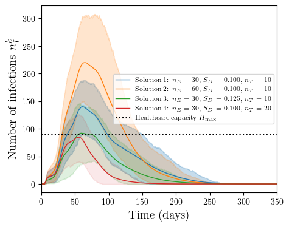
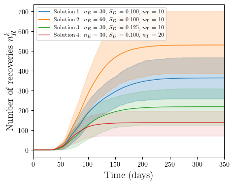

# COVID-19 agent-based simulation using C++
<a name="top"></a>


After seeing [this article](https://www.washingtonpost.com/graphics/2020/world/corona-simulator/) and checking out this cool [project](https://github.com/paulvangentcom/python_corona_simulation/) it occurred to me that there is room for improvement both in terms of agent-based modeling to simulate pandemics more realistically and to use them to come up with sound scientific intervention policies to bring the disease under control quickly without suffocating the economy. I created an agent based model with a lot of features in terms of code and execution optimization so that we can use exhaustive search and optimization algorithms to find those policies that hit that sweet-spot between controlling the pandemic and preserving jobs and economic activity.

I used the [Eigen](http://eigen.tuxfamily.org/index.php?title=Main_Page) linear algebra library to efficiently manipulate and store matrices that describe the state of the agents. I coupled the model with a lightweight [Qt](https://www.qt.io/) user interface and a scientific data visualization tool [qcustomplot](https://www.qcustomplot.com/) to visualize and control the model in realtime. I used [CUDA](https://developer.nvidia.com/cuda-downloads) to accelerate the computation of the many different interactions that occur between the agents in hopes of scaling this model to include millions of agents in the future.

I provide Python scripts to call the model in batch mode and run Monte-Carlo simulations to understand how different intervention measures affect the spread of the disease.

# Setup

## Dependencies 
[](https://anaconda.org/)
[](https://www.qt.io/download)
[](https://developer.nvidia.com/cuda-downloads)
[](https://visualstudio.microsoft.com/downloads/)

- [**SGTELIB**](https://github.com/bbopt/sgtelib) (optional) for sensitivity analysis
- **Qt** [5.15.1](https://www.qt.io/download) for user-interface
- (optional) **CUDA** [11.2.0](https://developer.nvidia.com/cuda-downloads) for GPU acceleration
- (optional) **Python** [3.8.3](https://anaconda.org/) or newer for statistics and post-processing
	- [**pyDOE**](https://pypi.org/project/pyDOE/) 
	- [**python-csv**](https://pypi.org/project/python-csv/) 
- Microsoft [**Visual Studio 2017**](https://visualstudio.microsoft.com/downloads/) or newer
	- Microsoft Visual Studio [**Qt Plugin**](https://marketplace.visualstudio.com/items?itemName=TheQtCompany.QtVisualStudioTools-19123/)
	
## Setting environment variables (only if using CUDA)

Install [CUDA](https://developer.nvidia.com/cuda-downloads).
Check that the `%CUDA%` environment variable has been set correctly by:
- Right click *This PC*, click *properties*
- Goto *Advanced system properties*
- Goto *Environment variables*
- Under *System variables* check that `%CUDA%` is set correctly to
```
C:\Program Files\NVIDIA GPU Computing Toolkit\CUDA\v11.2\libnvvp;
C:\Program Files\NVIDIA GPU Computing Toolkit\CUDA\v11.2\bin;
```
- Add `%CUDA%` to the `PATH` environment variable

## Compiling executable files (CUDA-capabale systems only)

Build the project executable using [COVID_SIM_UI_CUDA.sln](visual_studio/COVID_SIM_UI_CUDA.sln). This will dump the executable and all relevant dll's in the [build](build/) directory.

IMPORTANT: Check that you have a [CUDA-capable GPU](https://developer.nvidia.com/cuda-gpus) before building the project.

## Compiling executable files 

First disable GPU acceleration during compilation by going to [header/Defines.h](header/Defines.h) and commenting the line.

`#define GPU_ACC // comment to disable GPU acceleration`

Build the project executable using [COVID_SIM_UI.sln](visual_studio/COVID_SIM_UI.sln).
# Example usage

To run the model simply execute [COVID_SIM_UI.exe](build/COVID_SIM_UI.exe). The <a href="#top">user-interface</a> shown at the beginning will be shown.

Click the **run** button to start the simulation. Click the **pause** button to pause the simulation. Use the sliders to adjust the different intervention measures shown

- Infection chance
- Social distancing
- Number of tests/day

Other model parameters can be configured in the file [configuration_debug.ini](build/configuration_debug.ini). Simply open the file with a text editor such as [Notepad++](https://notepad-plus-plus.org/downloads/) and change the included paramters. Not all paramters are defined in the configuration file and removing any value from the [configuration_debug.ini](build/configuration_debug.ini) file will reset it to its default value. The list of parameters, their meaning, and their default values are given in the table in [Configuration_list.md](Configuration_list.md).

# Example usage in batch mode

The system command used to call the executable is

`COVID_SIM_UI <arg1> <arg2> <arg3> <arg4>` 

- `<arg1>` is the run index 
- `<arg2>` is the number of essential workers (`social_distance_violation` configuration parameter)
- `<arg3>` is the number of social distancing factor (`social_distance_factor` configuration parameter)
- `<arg4>` is the number of tests/day (`number_of_tests` configuration parameter)
- `<arg5>` is the output directory for objective (mobility) and constraint (maximum number of infections)

Copy the executable [COVID_SIM_UI.exe](build/COVID_SIM_UI.exe) and all dll files in [build](build/) to [build/COVID_DOE](build/COVID_DOE/).

- Launch the python file [MCS_model_points.py](build/COVID_DOE/MCS_model_points.py)
- Wait for execution to finish 
- Copy the resulting .pkl files in [build/COVID_DOE/data/](build/COVID_DOE/data/) to [build/COVID_visualize/population/](build/COVID_visualize/population/)
- Launch the python file [plot_profiles_stochastic.py](build/COVID_visualize/plot_profiles_stochastic.py)
- Copy the resulting .pkl files in [build/COVID_DOE/data/](build/COVID_DOE/data/) to [build/COVID_post/data/opts/](build/COVID_post/data/opts/)
- Launch the python file [MCS_model_points_post.py](build/COVID_post/MCS_model_points_post.py)
- The following plots are generated (may slightly differ due to randomness of the model)

infections	     				| fatalities
:------------------------------:|:---------------------:
 | 				

recoveries	     				| reproductive number
:------------------------------:|:---------------------:
 | 			

mobility	     				| Monte-Carlo (mobility)
:------------------------------:|:---------------------:
 | 

Monte-Carlo (fatalities)	    | Monte-Carlo (infections)
:------------------------------:|:---------------------:
 | 

# Example for performing a sensitivity study

After completing the previous example, follow the following procedure to perform a latin hypercube search across all the different possible combinations of interventions:

- Open the python file [MCS_model_LHS.py](build/COVID_DOE/MCS_model_LHS.py)
- adjust `n_samples_LH` and `n_samples` to reduce the number of simulations needed to obtain the data and launch
- Wait for execution to finish (can take a long time possibly hours, much faster with CUDA)
- Copy the resulting .pkl files in [build/COVID_DOE/data/](build/COVID_DOE/data/) to [build/COVID_post/data/LHS/](build/COVID_post/data/LHS/)
- Open the python file [MCS_model_post.py](build/COVID_post/MCS_model_post.py)
- adjust `n_samples_LH` according to what was selected in [MCS_model_LHS.py](build/COVID_DOE/MCS_model_LHS.py) and launch [MCS_model_post.py](build/COVID_post/MCS_model_post.py)
- Open the python file [main.py](build/COVID_post/main.py)
- adjust `n_samples_LH` according to what was selected in [MCS_model_LHS.py](build/COVID_DOE/MCS_model_LHS.py) and launch [main.py](build/COVID_post/main.py)
- The following plots are generated (may slightly differ due to randomness of the model)

**Expected value of mobility**

Red hatched regions show which combinations lead to infections exceeding healthcare capacity with a probability of 90 %


**Standard deviation of infections**


# Further reading

Please check the following article for more information related to optimization of interventions using agent-based models

- *Optimization of Infectious Disease Prevention and Control Policies Using Agent-based Modeling* [1](https://asmedigitalcollection.asme.org/mechanicaldesign/article-abstract/143/2/021702/1085767)


